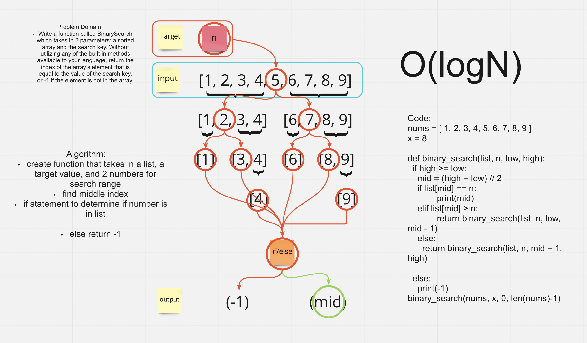

# [Data Structures and Algorithms](https://alsosteve.github.io/data-structures-and-algorithms/)
## [Language: Python](https://alsosteve.github.io/data-structures-and-algorithms/python/)

# array-binary-search
Write a function called BinarySearch which takes in 2 parameters: a sorted array and the search key. Without utilizing any of the built-in methods available to your language, return the index of the array’s element that is equal to the value of the search key, or -1 if the element is not in the array.

## Whiteboard Process

## Approach & Efficiency
I had a hard time thinking of a way to split the list that worked for even or odd lists.