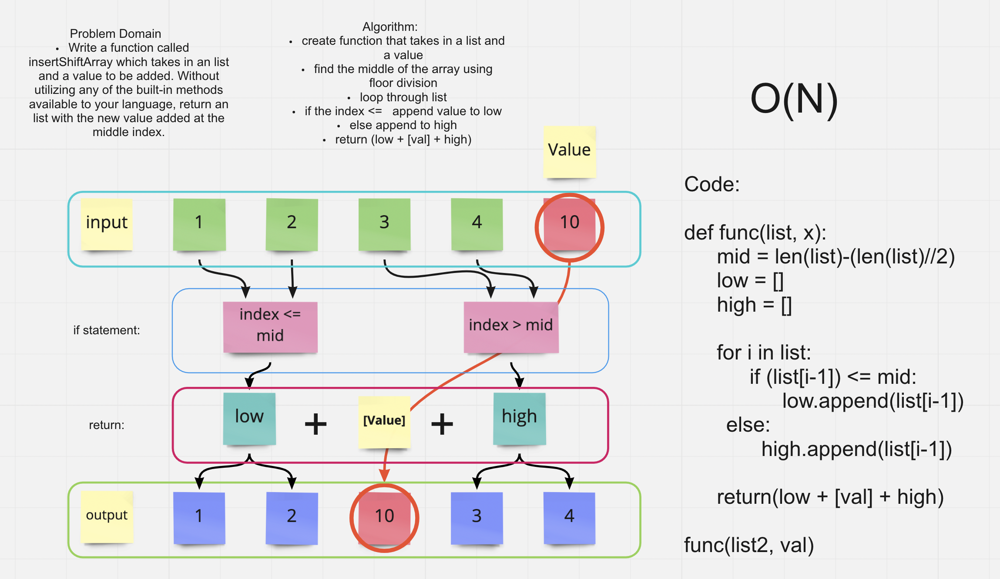

# [Data Structures and Algorithms](https://alsosteve.github.io/data-structures-and-algorithms/)
## [Language: Python](https://alsosteve.github.io/data-structures-and-algorithms/python/)

# Reverse an Array
Write a function called insertShiftArray which takes in an array and a value to be added. Without utilizing any of the built-in methods available to your language, return an array with the new value added at the middle index.

## Whiteboard Process

## Approach & Efficiency
I wasn't alowwed to use the .split() method so i created a loop that split the list in 2 and then added the lists back to gether with the new value in the middle.