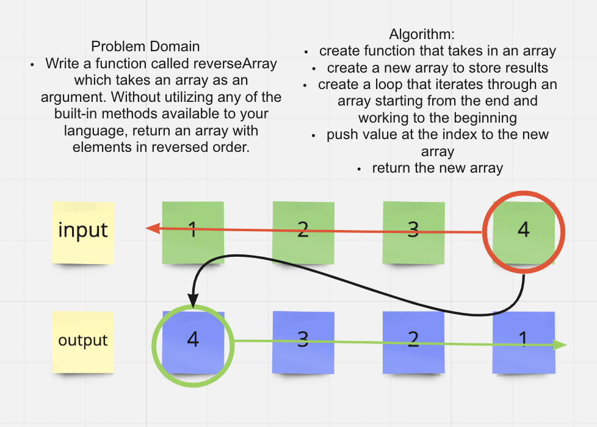

# [Data Structures and Algorithms](https://alsosteve.github.io/data-structures-and-algorithms/)
## [Language: Python](https://alsosteve.github.io/data-structures-and-algorithms/python/)

# Reverse an Array
Write a function called reverseArray which takes an array as an argument. Without utilizing any of the built-in methods available to your language, return an array with elements in reversed order.

## Whiteboard Process

## Approach & Efficiency
I drew out a visual of a for loop that starts at the end of an array and iterates backwards.