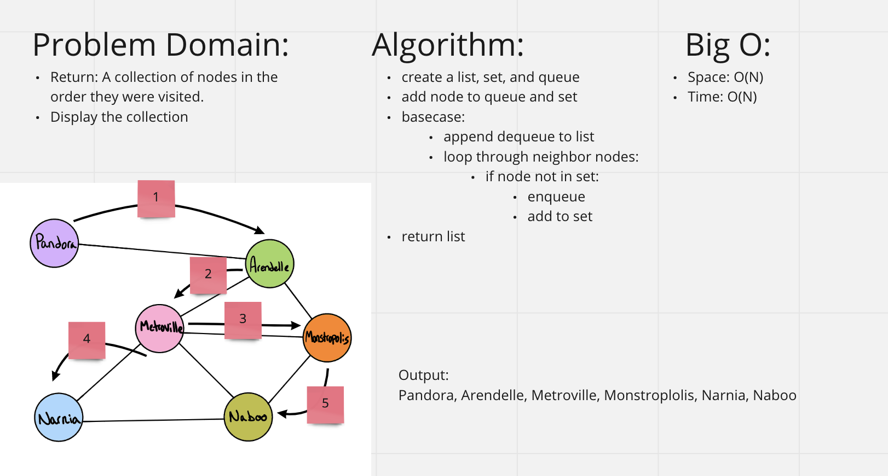

# [Data Structures and Algorithms](https://alsosteve.github.io/data-structures-and-algorithms/)
## [Language: Python](https://alsosteve.github.io/data-structures-and-algorithms/python/)

# Graph Breadth First
## Feature Tasks
Implement a breadth-first traversal on a graph.

### Method:
* breadth first
  * Arguments: Node
  * Return: A collection of nodes in the order they were visited.
  * Display the collection

## Whiteboard Process

## Examples
### Input

### Output
`Pandora, Arendelle, Metroville, Monstroplolis, Narnia, Naboo`

## Unit Tests
- return common values in tree

## Stretch Goal
Once you’ve achieved a working solution, define a new method that accepts two nodes as input and uses your traversal algorithm to determine if a path exists between the two nodes.

## Approach & Efficiency
