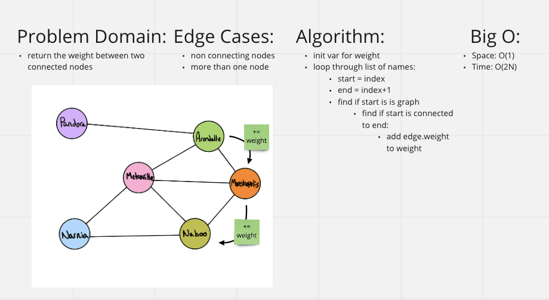

# [Data Structures and Algorithms](https://alsosteve.github.io/data-structures-and-algorithms/)
## [Language: Python](https://alsosteve.github.io/data-structures-and-algorithms/python/)

# Graph Business Trip
## Feature Tasks
Challenge Type: Code Challenge / Algorithm

### Method:
* business trip
  * Arguments: graph, array of city names
  * Return: the cost of the trip (if it’s possible) or null (if not)

## Whiteboard Process

## Examples
### Example

### Output
| Input	| Output |
|---|---|
| [Metroville, Pandora, ] | $82 |
| [Arendelle, New Monstropolis, Naboo] | $115 |
| [Naboo, Pandora] | null |
| [Narnia, Arendelle, Naboo] | null |

## Unit Tests
see example for testing

## Stretch Goal
None

## Approach & Efficiency
