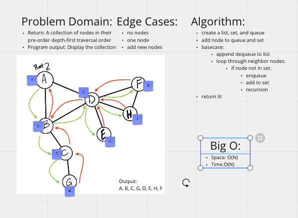

# [Data Structures and Algorithms](https://alsosteve.github.io/data-structures-and-algorithms/)
## [Language: Python](https://alsosteve.github.io/data-structures-and-algorithms/python/)

# Graph Depth First
## Feature Tasks
Challenge Type: Extending an Implementation

### Method:
* Depth first
  * Arguments: Node (Starting point of search)
  * Return: A collection of nodes in their pre-order depth-first traversal order
  * Program output: Display the collection

## Whiteboard Process

## Examples
### Example

### Output
`A, B, C, G, D, E, H, F`

## Unit Tests
see example for testing

## Stretch Goal
None

## Approach & Efficiency
