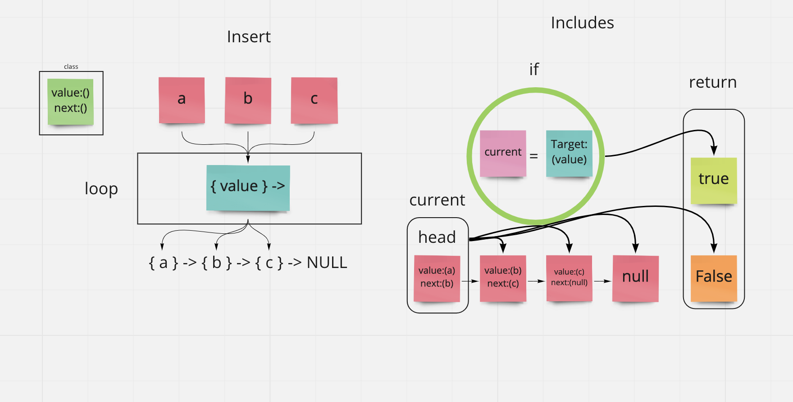

# [Data Structures and Algorithms](https://alsosteve.github.io/data-structures-and-algorithms/)
## [Language: Python](https://alsosteve.github.io/data-structures-and-algorithms/python/)

# Singly Linked Lists
## Node
* Create a Node class that has properties for the value stored in the Node, and a pointer to the next Node.
# Linked List
* Create a Linked List class
* Within your Linked List class, include a head property.
  * Upon instantiation, an empty Linked List should be created.
* The class should contain the following methods
  * insert
    * Arguments: value
    * Returns: nothing
    * Adds a new node with that value to the `head` of the list with an O(1) Time performance.
* includes
  * Arguments: value
  * Returns: Boolean
    * Indicates whether that value exists as a Node’s value somewhere within the list.
* to string
  * Arguments: none
  * Returns: a string representing all the values in the Linked List, formatted as:
  * `"[ a ] -> [ b ] -> [ c ] -> NULL"`
* Any exceptions or errors that come from your code should be semantic, capture-able errors. For example, rather than a default error thrown by your language, your code should raise/throw a custom, semantic error that describes what went wrong in calling the methods you wrote for this lab.
* Be sure to follow your language/frameworks standard naming conventions (e.g. C# uses PascalCasing for all method and class names).

## Whiteboard Process

## Approach & Efficiency
I drew out my own whiteboard from the one provided in class. I just followed allong the class demo for the most part.
