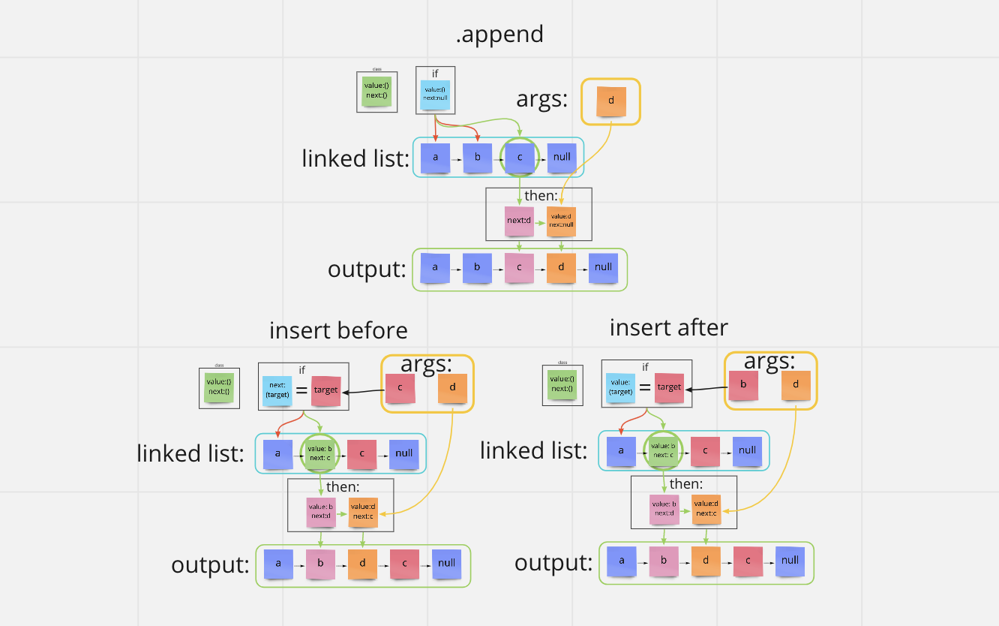

# [Data Structures and Algorithms](https://alsosteve.github.io/data-structures-and-algorithms/)
## [Language: Python](https://alsosteve.github.io/data-structures-and-algorithms/python/)

# Linked Lists Insertions
## Feature Tasks
Extend a Linked List to allow various insertion methods.

Write the following methods for the Linked List class:

* append
  * arguments: new value
  * adds a new node with the given value to the end of the list
* insert before
  * arguments: value, new value
  * adds a new node with the given new value immediately before the first node that has the value specified
* insert after
  * arguments: value, new value
  * adds a new node with the given new value immediately after the first node that has the value specified

## Whiteboard Process

## Examples
### Append

| Initial List                  |	Method Args |	Resulting List |
|-------------------------------|---|---|
| head -> [1] -> [3] -> [2] -> X |	5 |	head -> [1] -> [3] -> [2] -> [5] -> X |
| head -> X |	1 |	head -> [1] -> X   |

### Insert Before
| Initial List |	Method Args |	Resulting List |
|---|---|---|
| head -> [1] -> [3] -> [2] -> X	|	3, 5	|	head -> [1] -> [5] -> [3] -> [2] -> X |
| head -> [1] -> [3] -> [2] -> X	|	1, 5	|	head -> [5] -> [1] -> [3] -> [2] -> X |
| head -> [1] -> [2] -> [2] -> X	|	2, 5	|	head -> [1] -> [5] -> [2] -> [2] -> X |
| head -> [1] -> [3] -> [2] -> X	|	4, 5	|	No change, method exception |

### Insert After
| Initial List |	Method Args |	Resulting List |
|---|---|---|
| head -> [1] -> [3] -> [2] -> X	|	3, 5	|	head -> [1] -> [3] -> [5] -> [2] -> X |
| head -> [1] -> [3] -> [2] -> X	|	2, 5	|	head -> [1] -> [3] -> [2] -> [5] -> X |
| head -> [1] -> [2] -> [2] -> X	|	2, 5	|	head -> [1] -> [2] -> [5] -> [2] -> X |
| head -> [1] -> [3] -> [2] -> X	|	4, 5	|	No change, method exception |

## Unit Tests
Write tests to prove the following functionality:

1. Can successfully add a node to the end of the linked list
2. Can successfully add multiple nodes to the end of a linked list
3. Can successfully insert a node before a node located i the middle of a linked list
4. Can successfully insert a node before the first node of a linked list
5. Can successfully insert after a node in the middle of the linked list
6. Can successfully insert a node after the last node of the linked list

## Stretch Goal
Write an additional method to delete a node with the given value from the linked list.

## Approach & Efficiency
