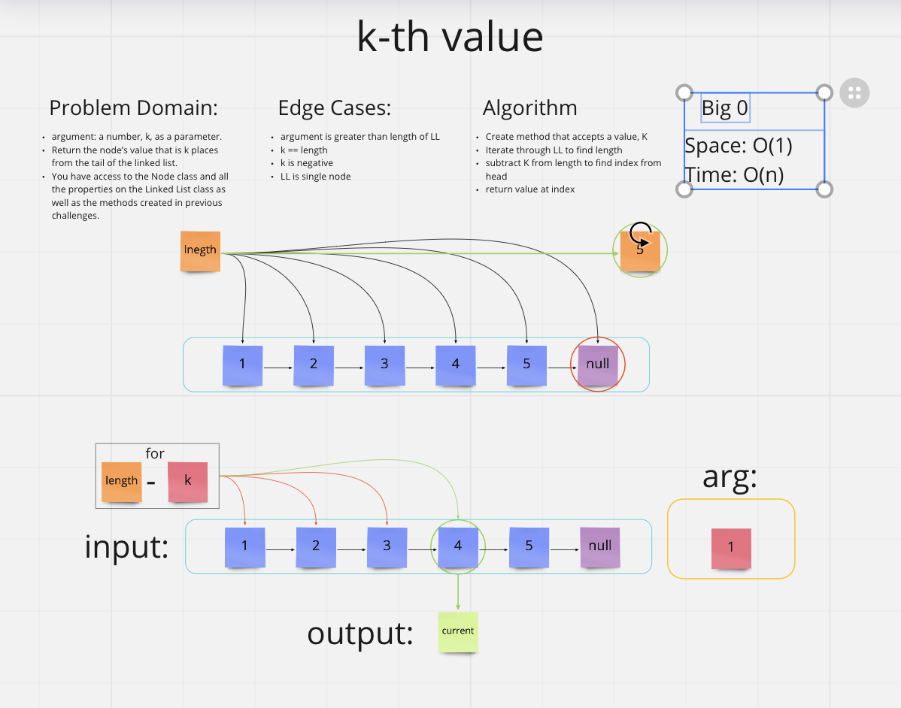

# [Data Structures and Algorithms](https://alsosteve.github.io/data-structures-and-algorithms/)
## [Language: Python](https://alsosteve.github.io/data-structures-and-algorithms/python/)

# Linked Lists Kth
## Feature Tasks
k-th value from the end of a linked list.

Write the following method for the Linked List class:

* kth from end
  * argument: a number, `k`, as a parameter.
  * Return the node’s value that is `k` places from the tail of the linked list.
  * You have access to the Node class and all the properties on the Linked List class as well as the methods created in previous challenges.

## Whiteboard Process

## Examples
`ll.kthFromEnd(k)`

| Input `ll`	| Arg `k`	| Output |
|---|---|---|
| head -> [1] -> [3] -> [8] -> [2] -> X |	0	| 2 |
| head -> [1] -> [3] -> [8] -> [2] -> X |	2 |	3 |
| head -> [1] -> [3] -> [8] -> [2] -> X |	6 |	Exception |

## Unit Tests
Write tests for the following scenarios, and any other cases:

1. Where k is greater than the length of the linked list
2. Where k and the length of the list are the same
3. Where k is not a positive integer
4. Where the linked list is of a size 1
5. “Happy Path” where k is not at the end, but somewhere in the middle of the linked list

## Stretch Goal
Implement a method that finds the node at the middle of the Linked List.

## Approach & Efficiency
