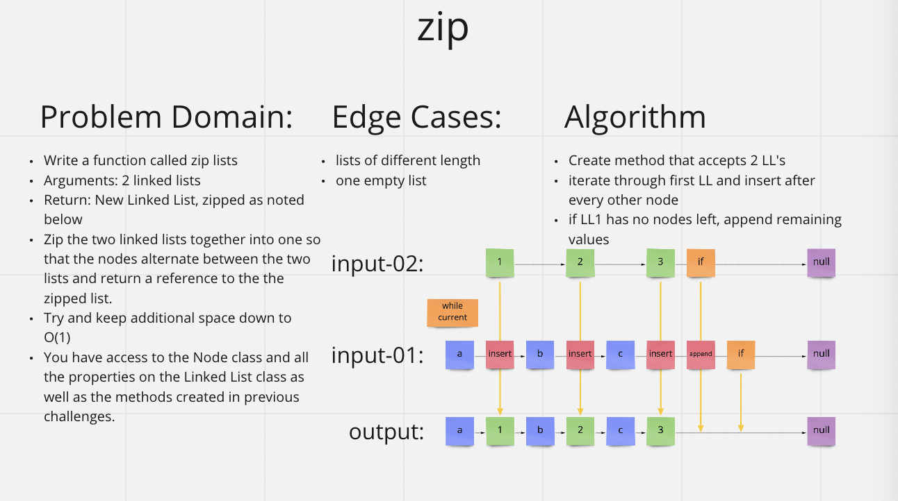

# [Data Structures and Algorithms](https://alsosteve.github.io/data-structures-and-algorithms/)
## [Language: Python](https://alsosteve.github.io/data-structures-and-algorithms/python/)

# Linked Lists Zip
## Feature Tasks
Zip two linked lists.

Write the following method for the Linked List class:

* Write a function called zip lists
* Arguments: 2 linked lists
* Return: New Linked List, zipped as noted below
* Zip the two linked lists together into one so that the nodes alternate between the two lists and return a reference to the the zipped list.
* Try and keep additional space down to O(1)
* You have access to the Node class and all the properties on the Linked List class as well as the methods created in previous challenges.

## Whiteboard Process

## Examples
`zipLists(list1, list2)`

| Arg `list1`	| Arg `list2`	| Output |
|---|---|---|
| [1] -> [3] -> [2] -> null	| [5] -> [9] -> [4] -> null	|	[1] -> [5] -> [3] -> [9] -> [2] -> [4] -> null	|
| [1] -> [3] -> null	[5] -> [9] -> [4] -> null	|	[1] -> [5] -> [3] -> [9] -> [4] -> null	|
| [1] -> [3] -> [2] -> null	[5] -> [9] -> null	|	[1] -> [5] -> [3] -> [9] -> [2] -> null	|

## Unit Tests
- lists of even length
- lists of diffrent length
- one empty list

## Stretch Goal
Implement another function that merges two sorted linked lists into a single sorted linked list.

## Approach & Efficiency
