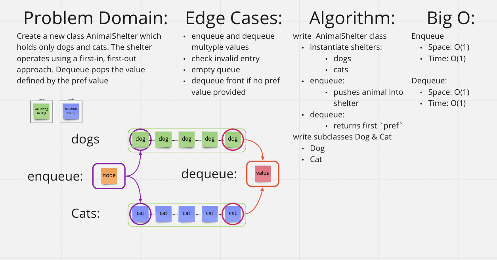

# [Data Structures and Algorithms](https://alsosteve.github.io/data-structures-and-algorithms/)
## [Language: Python](https://alsosteve.github.io/data-structures-and-algorithms/python/)

# Stack and a Queue: Animal Shelter
## Feature Tasks
Create a new class AnimalShelter which holds only dogs and cats. The shelter operates using a first-in, first-out approach.

### Methods:

#### enqueue
- Arguments: `animal`
  - `animal` can be either a dog or a cat object.

#### dequeue
- Arguments: `perf`
  - `pref` can be either `"dog"` or `"cat"`

- Return: either a dog or a cat, based on preference.
  - If `pref` is not `"dog"` or `"cat"` then return `null`.

## Whiteboard Process

## Examples
none

## Unit Tests
* sub class `cat` can be enqueued and dequeued
* sub class `dog` can be enqueued and dequeued
* skips front value in favor of preferred
* enqueue and dequeue multyple values
* check invalid entry

## Stretch Goal
If a cat or dog isn’t preferred, return whichever animal has been waiting in the shelter the longest.

## Approach & Efficiency
My origional whiteboard didn't work so I scrapped it and tried the method explained by JB to complete the challenge.
