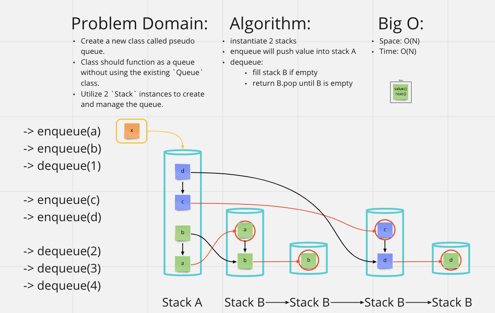

# [Data Structures and Algorithms](https://alsosteve.github.io/data-structures-and-algorithms/)
## [Language: Python](https://alsosteve.github.io/data-structures-and-algorithms/python/)

# Stack and a Queue: Pseudo Queue
## Feature Tasks
Create a new class called pseudo queue. Class should function as a queue without using the existing `Queue` class.  Utilize 2 `Stack` instances to create and manage the queue.

### Methods:

#### enqueue
- Arguments: value
- Inserts `value` into the PseudoQueue, using a first-in, first-out approach.

#### dequeue
- Arguments: none
- Extracts a value from the PseudoQueue, using a first-in, first-out approach.h

## Whiteboard Process

## Examples

`enqueue(value)`

| Input |	Args | Output |
|---|---|---|
| [10]->[15]->[20]	 | 5 | [5]->[10]->[15]->[20] |
|  | 5 | [5] |

`dequeue()`

| Input |	Output | Internal State |
|---|---|---|
| [5]->[10]->[15]->[20]	 | 20 | [5]->[10]->[15] |
| [5]->[10]->[15]	 | 15 | [5]->[10] |

## Unit Tests
* enqueue and dequeue one item
* enqueue and dequeue two item
* multyple enqueues and dequeues to test desired functionality.

## Stretch Goal
None

## Approach & Efficiency
`.enqueue` is only concerned with the first in part of, "first in, first," out so all i had to do was use a `.push` from the `Stack` class. Next I used a second stack to reverse my origional stack to `.dequeue` the first item pushed into my origional stack.
