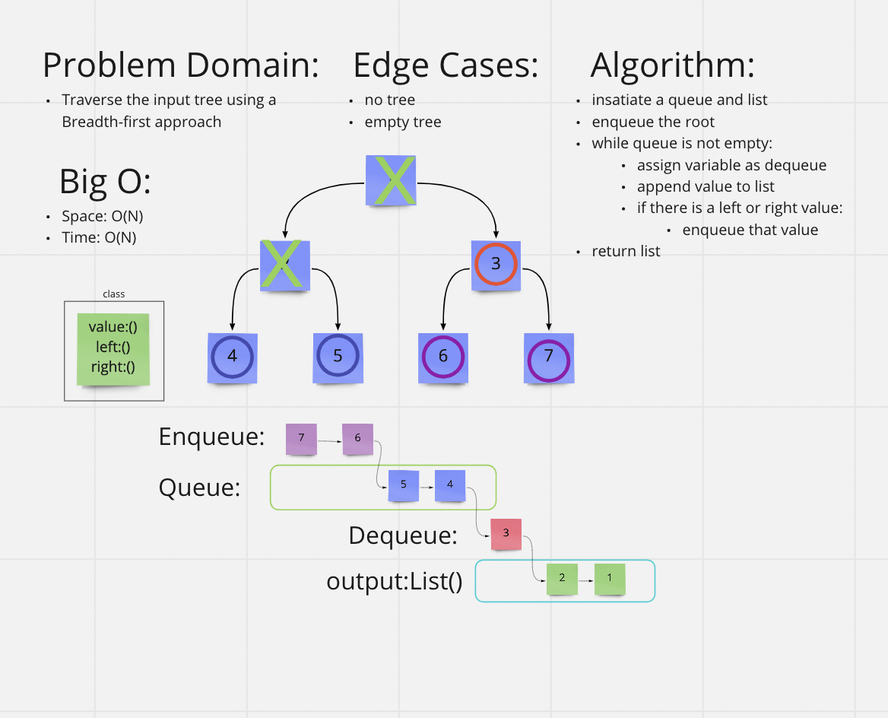

# [Data Structures and Algorithms](https://alsosteve.github.io/data-structures-and-algorithms/)
## [Language: Python](https://alsosteve.github.io/data-structures-and-algorithms/python/)

# Trees: Breadth First Traversal
## Feature Tasks
Challenge Type: Code Challenge / Algorithm

* Write a function called breadth first
* Arguments: tree
* Return: list of all values in the tree, in the order they were encountered

## Whiteboard Process

## Examples
### Input:

### Output:
`[2,7,5,2,6,9,5,11,4]`

## Unit Tests

## Stretch Goal
None

## Approach & Efficiency
I solved this by using the pseudocode provided in the trees reading notes. It was basically a walk through.
