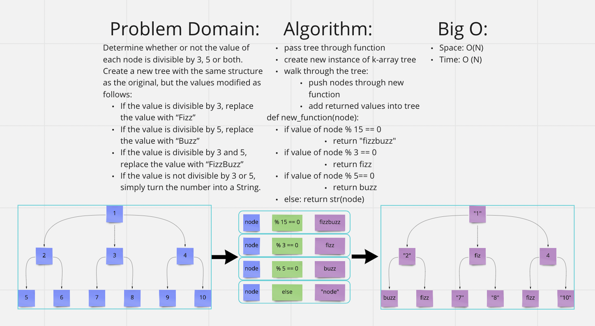

# [Data Structures and Algorithms](https://alsosteve.github.io/data-structures-and-algorithms/)
## [Language: Python](https://alsosteve.github.io/data-structures-and-algorithms/python/)

# Trees: Fizz Buzz
## Feature Tasks
Challenge Type: Code Challenge / Algorithm

### Method:
* Write a function called fizz buzz tree
* Arguments: k-ary tree
* Return: new k-ary tree

Determine whether or not the value of each node is divisible by 3, 5 or both. Create a new tree with the same structure as the original, but the values modified as follows:

* If the value is divisible by 3, replace the value with “Fizz”
* If the value is divisible by 5, replace the value with “Buzz”
* If the value is divisible by 3 and 5, replace the value with “FizzBuzz”
* If the value is not divisible by 3 or 5, simply turn the number into a String.

## Whiteboard Process

## Examples
None

## Unit Tests
* return correct values
* check if old tree was altered or not

## Stretch Goal
None

## Approach & Efficiency
I had to figure out how to walk through a K-array tree using the provided data structure code. Then I just pushed new values into a new tree.