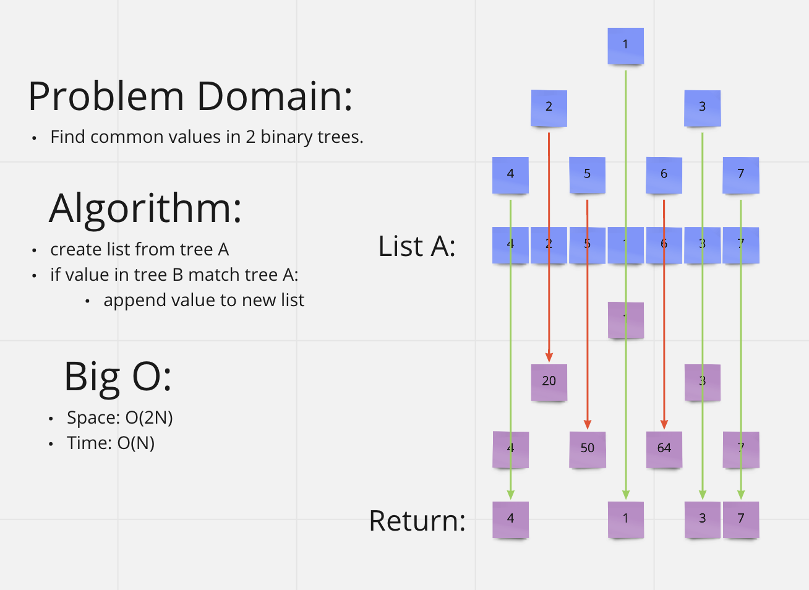

# [Data Structures and Algorithms](https://alsosteve.github.io/data-structures-and-algorithms/)
## [Language: Python](https://alsosteve.github.io/data-structures-and-algorithms/python/)

# Hashmap: Tree Intersection
## Feature Tasks
Find common values in 2 binary trees.

### Method:
Write a function called `tree_intersection` that takes two binary trees as parameters.
Using your Hashmap implementation as a part of your algorithm, return a set of values found in both trees.

## Whiteboard Process

## Examples
### Input

### Output
`100,160,125,175,200,350,500`

## Unit Tests
- return common values in tree

## Stretch Goal
* Describe how you might solve this differently if the parameters were Binary Search Trees.
* What are the potential efficiency differences?

## Approach & Efficiency
