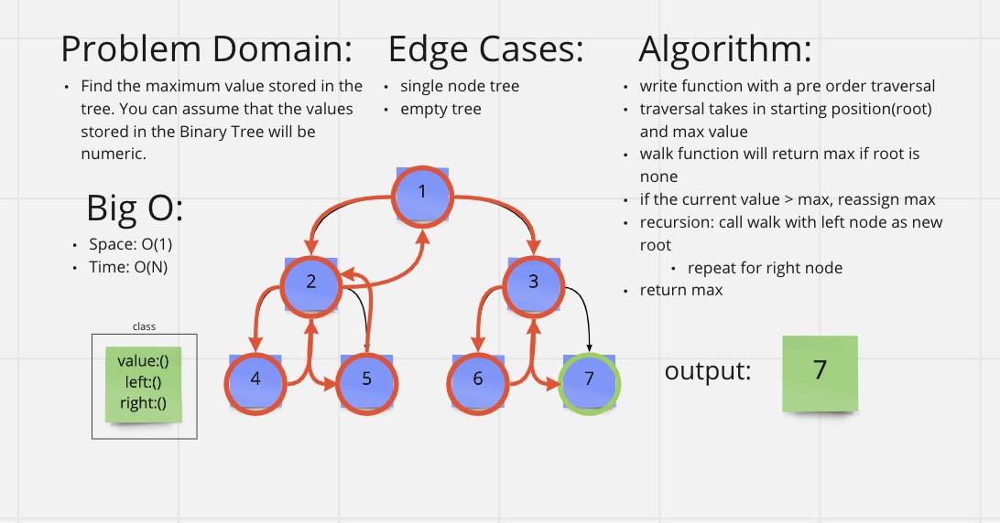

# [Data Structures and Algorithms](https://alsosteve.github.io/data-structures-and-algorithms/)
## [Language: Python](https://alsosteve.github.io/data-structures-and-algorithms/python/)

# Trees: Max
## Feature Tasks
Challenge Type: Extending an Implementation

### Methods:
Write the following method for the Binary Tree class

* find maximum value
  * Arguments: none
  * Returns: number

Find the maximum value stored in the tree. You can assume that the values stored in the Binary Tree will be numeric.

## Whiteboard Process

## Examples
### Input:

### Output:
`11`

## Unit Tests
test described in examples

## Stretch Goal
None

## Approach & Efficiency
I had to rewrite my algorythm and code a few times because my solution was failing.