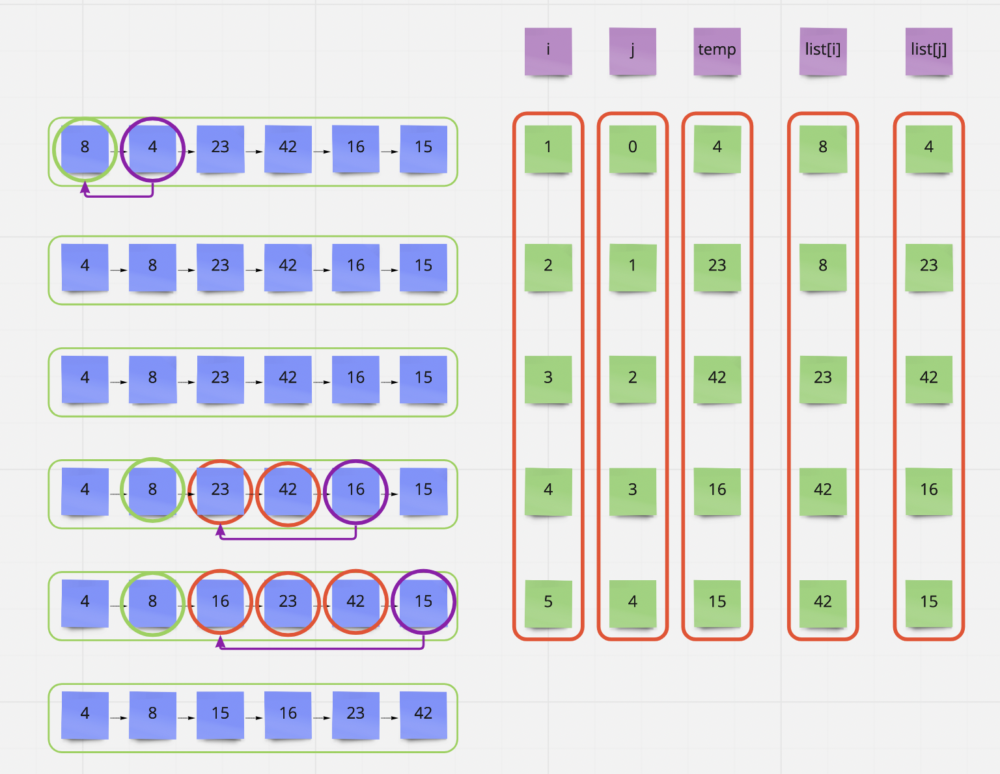

# Blog Notes: Insertion Sort
# [Data Structures and Algorithms](https://alsosteve.github.io/data-structures-and-algorithms/)
## [Language: Python](https://alsosteve.github.io/data-structures-and-algorithms/python/)

# Insertion Sort
## Feature Tasks
Review the pseudocode below, then trace the algorithm by stepping through the process with the provided sample array. Document your explanation by creating a blog article that shows the step-by-step output after each iteration through some sort of visual.

Once you are done with your article, code a working, tested implementation of Insertion Sort based on the pseudocode provided.

You may review an example document [HERE](https://codefellows.github.io/common_curriculum/data_structures_and_algorithms/Code_401/class-26/solutions/BLOG)

## Algorithm
- write function that takes in a list
- for loop that iterates length of list number of times
  - new variables J is i - 1
  - new variables temp is value at index
  - while loop that moves number into place
- return list

## Pseudocode

```
  InsertionSort(int[] arr)

    FOR i = 1 to arr.length

      int j <-- i - 1
      int temp <-- arr[i]

      WHILE j >= 0 AND temp < arr[j]
        arr[j + 1] <-- arr[j]
        j <-- j - 1

      arr[j + 1] <-- temp
```

## Code

``` python
def insertion_sort(list):

    for i in range(len(list)):

      j = i - 1
      temp = list[i]

      while j >= 0 and temp < list[j]:
        list[j + 1] = list[j]
        j -= 1

      list[j + 1] = temp

    return list

```

## Sample Arrays
In your blog article, visually show the output of processing this input array:

`[8,4,23,42,16,15]`

For your own understanding, consider also stepping through these inputs:

* Reverse-sorted: `[20,18,12,8,5,-2]`
* Few uniques: `[5,12,7,5,5,7]`
* Nearly-sorted: `[2,3,5,7,13,11]`

### Implementation
* Provide a visual step through for each of the sample arrays based on the provided pseudo code
* Convert the pseudo-code into working code in your language
* Present a complete set of working tests

## Whiteboard Process


## Stretch Goal
Share your article on LinkedIn, so that your network knows how awesome you are.

## Approach & Efficiency
