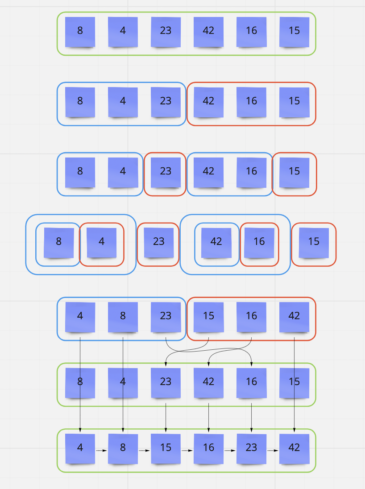

# Blog Notes: Merge Sort
# [Data Structures and Algorithms](https://alsosteve.github.io/data-structures-and-algorithms/)
## [Language: Python](https://alsosteve.github.io/data-structures-and-algorithms/python/)

# Code Challenge: 27
## Feature Tasks
Review the pseudocode below, then trace the algorithm by stepping through the process with the provided sample array. Document your explanation by creating a blog article that shows the step-by-step output after each iteration through some sort of visual.

Once you are done with your article, code a working, tested implementation of Merge Sort based on the pseudocode provided.

## Algorithm
- write a method that takes in a `list`
  - split the list into a `left` and `right` lists
  - sort both lists with recursion
  - merge the lists with `merge` method
  - return

- write merge method that takes in `left`, `right` , and `original` list
  - inst variables i, j, k == 0
  - conditional statement
  - zip lists together
## Pseudocode

```

ALGORITHM Mergesort(arr)
    DECLARE n <-- arr.length

    if n > 1
      DECLARE mid <-- n/2
      DECLARE left <-- arr[0...mid]
      DECLARE right <-- arr[mid...n]
      // sort the left side
      Mergesort(left)
      // sort the right side
      Mergesort(right)
      // merge the sorted left and right sides together
      Merge(left, right, arr)

ALGORITHM Merge(left, right, arr)
    DECLARE i <-- 0
    DECLARE j <-- 0
    DECLARE k <-- 0

    while i < left.length && j < right.length
        if left[i] <= right[j]
            arr[k] <-- left[i]
            i <-- i + 1
        else
            arr[k] <-- right[j]
            j <-- j + 1

        k <-- k + 1

    if i = left.length
       set remaining entries in arr to remaining values in right
    else
       set remaining entries in arr to remaining values in left
```

## Code

``` python
def merge_sort(list):
    n = len(list)
    if n > 1:
        mid = n//2
        left = list[:mid]
        right = list[mid:]

        merge_sort(left)
        merge_sort(right)
        merge(left, right, list)
    return list

def merge(left, right, list):
    i, j, k = 0, 0, 0
    while i < len(left) and j < len(right):
        if left[i] <= right[j]:
            list[k] = left[i]
            i += 1
        else:
            list[k] = right[j]
            j += 1
        k += 1

    if i == len(left):
        while j < len(right):
            list[k] = right[j]
            j += 1
            k += 1
    else:
        while i < len(left):
            list[k] = left[i]
            i = i + 1
            k = k + 1

```

## Sample Arrays

`[8,4,23,42,16,15]`

For your own understanding, consider also stepping through these inputs:

* Reverse-sorted: `[20,18,12,8,5,-2]`
* Few uniques: `[5,12,7,5,5,7]`
* Nearly-sorted: `[2,3,5,7,13,11]`

### Implementation
* Provide a visual step through for each of the sample arrays based on the provided pseudo code
* Convert the pseudo-code into working code in your language
* Present a complete set of working tests

## Whiteboard Process


## Stretch Goal
Share your article on LinkedIn, so that your network knows how awesome you are.

## Approach & Efficiency
